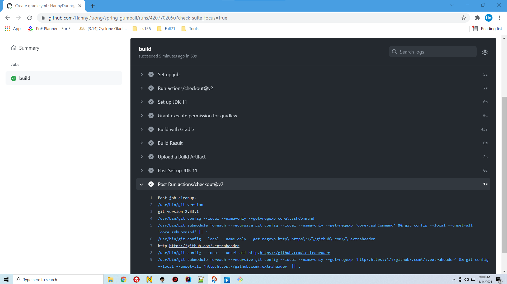

# CMPE 172 - Lab #10 Notes

### CI Workflow

	

&nbsp;

## Lab Notes

### CI Workflow

* Reference: https://docs.github.com/en/actions/automating-builds-and-tests/building-and-testing-java-with-gradle
* Continuous integration (CI) 
* Objectives:
	*  Create a workflow that performs continuous integration for Java project using Gradle build system.
	* The workflow you create will allow you:
		* To see when commits to a pull requst cause build or test failures against your default branch.
		* Ensure that your code is always healthy.
		* Can extend CI workflow to caches files and upload artifacts from a workflow run.
* Create a CI workflow
	* Select Action -> Find Java with Gradle -> Set up this workflow
	* Make change to the predefined yml file
	

